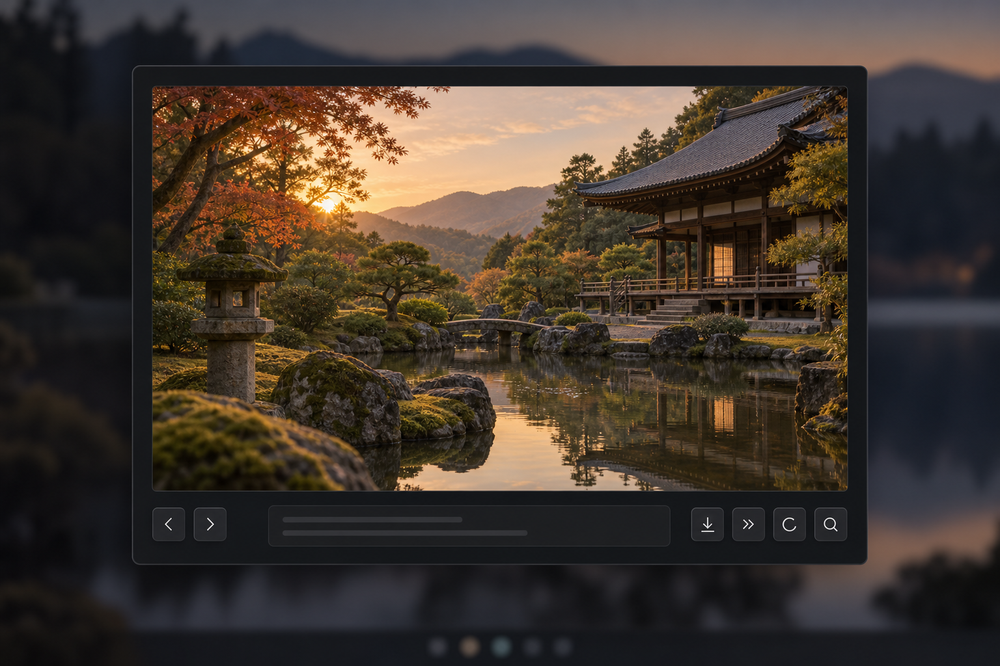

# Memory Lane

Photos pile up, and the stories behind them are easy to lose. Memory Lane helps
by resurfacing them one at a time so you can record the moments, people, and
places that matter. It is a local-first Omarchy shell plugin that never uploads
or modifies original files.



## Features

- Library actions in the **⋯** menu: open a specific photo from an approved
  folder (without waiting for a scan), or rescan folders in the background.
  Rescans keep your current photo and unsaved text in place and report new photos.

- Map-pin button opens embedded photo GPS coordinates on OpenStreetMap;
  coordinates are shared only when clicked, never the photo or notes.
- Private scanning of user-approved folders
- Randomized presentation with occasional resurfacing of annotated photos
- Fast keyboard navigation with session history
- One free-flowing journal per photo, with local drafts and gently rolling questions
- Metadata-stripped preview images
- Session-only preview rotation that never changes the original
- One-click access to the original photograph

## Install

Existing installations: read the [storage upgrade checklist](docs/security-upgrade.md)
before installing the storage-hardening update. Old database sidecar permissions
may require a supervised, backup-first migration.

Install and enable Memory Lane directly from its public repository:

```bash
omarchy plugin add https://github.com/ssojoodi/memory-lane.git --enable
```

Remove the plugin UI with:

```bash
omarchy plugin remove sojoodi.memory-lane --yes
```

Notes remain in `~/.local/share/memory-lane/` unless removed separately.

## Development install

```bash
bash scripts/install-local.sh
```

The installer copies runtime files to
`~/.config/omarchy/plugins/sojoodi.memory-lane`, validates the plugin, enables
it, and adds its photo icon to the right side of the bar.

Run the same command after making local changes.

## Controls

| Key | Action |
| --- | --- |
| `Left` / `Right` | Previous / next photo |
| `S` | Skip and advance |
| `R` | Rotate the displayed preview 90° clockwise |
| `O` | Reveal original in Files |
| `Ctrl+Enter` | Save while editing |
| `Escape` | Close |

## Privacy and storage

- Database: `${XDG_DATA_HOME:-~/.local/share}/memory-lane/memory-lane.sqlite3`
- Previews: `${XDG_CACHE_HOME:-~/.cache}/memory-lane/previews/`
- Source photos are opened read-only and never moved, renamed, or rewritten.
- Preview rotation lasts only for the open session and is never written to disk.
- The runtime makes no network requests.
- Scanning begins only after folder approval and never follows symlinks.

See [docs/privacy.md](docs/privacy.md) and [docs/design.md](docs/design.md) for
more detail.

## Dependencies

Memory Lane targets Omarchy 4 and uses Python 3, SQLite, libvips, Nautilus, and
`omarchy-file-select`. These runtime dependencies are included with Omarchy 4.

## Development

Run the full checks with:

```bash
python3 -m unittest discover -s tests/python
node tests/js/memory-lane-model-test.js
bash tests/contract/plugin-test.sh
```

## License

[MIT](LICENSE)
